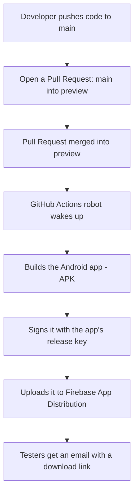

# NooLure — App Build & Release Guide (No Tech Background Needed)

This document explains, in plain language, how a new version of the NooLure Android app gets built and delivered to testers automatically — and what to do if that process ever breaks.

---

## 1. The Simple Version

> Every time approved code is merged into the **`preview`** branch on GitHub, a robot (GitHub Actions) automatically builds the Android app, signs it, and sends it to testers via Firebase App Distribution — no human has to build or upload anything by hand.

Total time from "merge" to "testers notified": roughly 5–10 minutes.

---

## 2. Where to Watch It Happen

1. Go to the GitHub repository page.
2. Click the **Actions** tab at the top.
3. You'll see a list of runs. Look for **"Preview Distribution"**.
   - 🟡 Yellow dot = still running
   - ✅ Green check = success — testers will get the app shortly
   - ❌ Red X = it failed — see Section 5 below

You don't need to click into anything technical — the colored icon tells you everything at a glance.

---

## 3. How To Actually Ship a New Build (Step by Step)

1. Make your code changes and push them to the **`main`** branch as usual.
2. On GitHub, open a **Pull Request** with:
   - Base branch: `preview`
   - Compare branch: `main`
3. Review it, then click **Merge Pull Request**.
4. That's it. The robot takes over automatically — go watch the **Actions** tab if you're curious.
5. Once it turns green, check your email (or the Firebase App Distribution page) for the new build.

You never need to manually create an APK or upload anything anywhere — if you're doing that by hand, something is wrong.

---

## 4. The One-Time Setup Behind the Scenes (Already Done ✅)

For the robot to be able to build and sign the app, it needs a few pieces of information stored securely in GitHub (called "Secrets"). These are **already configured** — this section is just so a future maintainer understands what exists and why, without needing to see the actual values (nobody can view secret values again once saved, including us — only replace them).

You can see the list (names only, never the values) at:
**GitHub repo → Settings → Secrets and variables → Actions**

| Secret Name | Plain-English Purpose |
|---|---|
| `GOOGLE_SERVICES_JSON` | The Firebase configuration file the app needs to talk to Firebase (login, database, etc.) |
| `FIREBASE_ANDROID_APP_ID` | The unique ID of the Android app inside our Firebase project |
| `ANDROID_KEYSTORE_BASE64` | The app's official "signing key" file — like a stamp that proves the app is really from us |
| `ANDROID_KEYSTORE_PASSWORD` | Password protecting that signing key file |
| `ANDROID_KEY_PASSWORD` | Password for the specific key inside that file |
| `ANDROID_KEY_ALIAS` | The name/label of that specific key (currently: `noolure`) |
| `FIREBASE_SERVICE_ACCOUNT` | A robot account that's allowed to upload builds to Firebase App Distribution on our behalf |

### ⚠️ The most important thing to know: the Signing Key

The **signing key** (`ANDROID_KEYSTORE_BASE64` + its passwords) is the digital identity of this app. A few critical facts:

- **It cannot be recovered if lost.** GitHub Secrets can be *replaced* but never *viewed* again.
- If this app is ever published to the Google Play Store, **every future update must be signed with this exact same key**, or Google Play will reject it.
- A backup copy of the keystore file and its passwords was saved outside of GitHub at the time it was created (kept by the project owner). If you're reading this and don't know where that backup is, find out **before** you ever need to replace it — losing it means you'd have to publish the app as a brand-new listing.
- Never commit the keystore file (`.jks`) to git. It's intentionally excluded via `.gitignore`.

---

## 5. If the Build Fails (Red ❌ in the Actions Tab)

Don't panic — click into the failed run and look at which step has the ❌. Here's a plain-language guide to the most common causes:

| Symptom in the logs | What it usually means | What to do |
|---|---|---|
| "`...decoded empty — check the ... secret`" | One of the secrets in Section 4 is missing or was deleted | Go to repo Settings → Secrets, re-add the missing one |
| "`applicationId ... is not a valid ...`" | Someone changed the app's package name incorrectly in the Android project | Ask a developer to check `android/app/build.gradle.kts` |
| Failure during "Build signed release APK" | Usually an actual code/compilation problem, or a wrong password stored in secrets | Needs a developer to read the error and fix the code, or double-check the keystore passwords |
| Failure during "Distribute to Firebase App Distribution" | The Firebase robot account (`FIREBASE_SERVICE_ACCOUNT`) may have lost permission, or expired | A developer needs to regenerate the service account key in Google Cloud Console and update the secret |
| No run shows up at all after merging | The merge might not have actually gone into the `preview` branch, or Actions might be disabled for the repo | Confirm the PR target branch was `preview`, and check repo Settings → Actions is enabled |

**If you're not technical and something fails:** take a screenshot of the red ❌ screen in the Actions tab and send it to a developer — that alone is usually enough for them to diagnose it in minutes.

---

## 6. What Each Build Step Actually Does (For Curious Non-Developers)

In order, here's what the robot does every time, translated to plain English:

1. **Checkout** – downloads a fresh copy of the code.
2. **Verify applicationId** – double-checks the app's internal name is written correctly (fails fast if not, before wasting time building).
3. **Set up JDK 17 / Set up Flutter** – installs the programming tools needed to build an Android app.
4. **Cache Gradle dependencies** – reuses previously-downloaded build tools instead of re-downloading them every time, which speeds things up.
5. **Install Dart/Flutter dependencies** – downloads the app's building blocks (packages/libraries).
6. **Decode Firebase config / Decode release keystore** – unlocks the secrets from Section 4 so the app can be built and signed.
7. **Write key.properties** – prepares the signing instructions for the build tool.
8. **Build signed release APK** – actually compiles and signs the Android app file.
9. **Install firebase-tools / Authenticate** – installs and logs into the tool that talks to Firebase App Distribution.
10. **Build release notes** – automatically writes "what's in this build" using your commit message.
11. **Distribute to Firebase App Distribution** – uploads the finished app and notifies the `preview` tester group by email.

---

## 7. Recent Speed Improvements

The pipeline was recently reviewed and trimmed to build faster:

- ❌ **Removed**: an old "delete previous releases before uploading" cleanup step. It was silently failing anyway (a CLI version mismatch), and it never affected whether new builds reached testers — it only tried to tidy up old builds in Firebase App Distribution. Old builds will now simply accumulate there; they can be deleted manually and occasionally from the Firebase Console if the list gets long.
- ❌ **Removed**: verbose (`-v`) build logging, which only made logs longer without adding value once the pipeline was confirmed working.
- ✅ **Added**: Gradle dependency caching, so repeated builds don't have to re-download the same Android build tools every single time — this is typically the biggest time-saver for Android CI builds.

---

## 8. Quick Reference

| Question | Answer |
|---|---|
| Where do I watch a build? | GitHub → **Actions** tab |
| How do I trigger a build? | Merge a Pull Request from `main` into `preview` |
| Where do testers get the app? | Email from Firebase App Distribution (group: `preview`) |
| Where are the secrets stored? | GitHub → **Settings → Secrets and variables → Actions** |
| Can I see secret values again? | No — GitHub only lets you replace them, never view them |
| Where's the signing key backed up? | Ask the project owner — it must never be lost |
